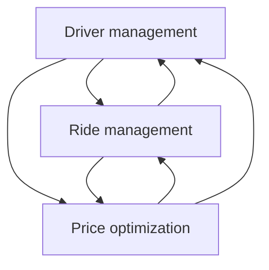
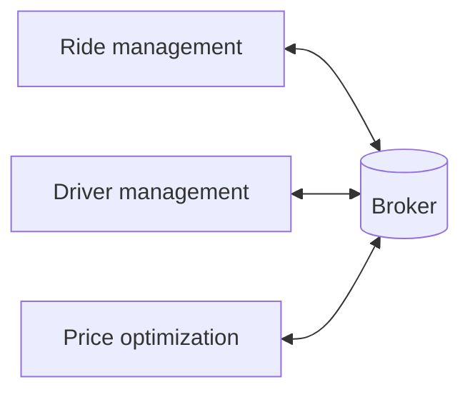

# Word Stand For

**_ML_**: Machine Learning
**_MLs_**: Machine Learning Systems
**_MLp_**: Machine Learning platforms
**_NN_**: Neural Network
**_diff_**: different | difference
**_ur_**: your | our
**_dev_**: develop | -ing | -ment
**_dep_**: deploy | -ing | -ment
**_eva_**: evaluate| -ing
**_reg_**: regression
**_cls_**: classification
**_sys_**: system
**_swe_**: software engineering

## [Link Book](<./book/Chip%20Huyen%20-%20Designing%20Machine%20Learning%20Systems_%20An%20Iterative%20Process%20for%20Production-Ready%20Applications-O'Reilly%20Media%20(2022).pdf>)

# Preface

#MachineLearning
#Algorithm
#Metrics

Machine Learning systems are both complex and unique

1. **Complex**: they consist of many different components (ML algorithms, data, business logic, evaluation metrics, underlying infrastructure, etc.) and involve many different stakeholders (DS, ML Engineers, business leaders, users, even society at large)
2. **Unique**: they are data dependent, with data varying wildly from one use case to the next

In this book, we will design ML (Machine Learning) systems that are reliable, scalable, maintainable, and adaptive

We will tackle scenarios such as:

- Engineering data and choosing the right metrics to solve business problem
- Automating the process of continually developing, evaluating, deploying and updating models
- Developing a monitoring systems to quickly detect and address issues your models might encounter in production
- Architecting an ML platform
- Developing responsible ML systems

## Navigating This Book

#Deployment

**The first two chapters** lay down the groundwork to set an ML project up for success. It also covers choosing the objectives for your project and how to frame your problem in a way that makes for simpler solutions

**Chapter 4 to 6** cover the pre-deployment phase of an ML project: from creating the training data and engineering features to developing and evaluating our models.

**Chapter 7 to 9** cover the deployment and post-deployment phase. The deployed model will need to be monitored and continually updated

**Chapter 3 and 10** focus on the infrastructure needed to enable stakeholders from diff backgrounds to work together to deliver successful ML systems. **Chapter 3** focuses on data systems, whereas **Chapter 10** focuses on compute infrastructure and ML platforms.

# Chapter 1: Overview of Machine Learning Systems

#MLOps
#DevOps

One of the first success stories of deep artificial NN in production, in November 2016, Google announced that it had incorporated its multilingual (đa ngôn ngữ) neural machine translation system into Google Translate.

Many people, when they hear "MLs", think of just the ML algorithms being used such as Logistic Reg or diff types of NN. However, the algorithms is only a small part of an MLs in production.

![[Pasted image 20240713152027.png]]

#### Note: The Relationship Between MLOps and MLs Design

Ops in MLOps comes from DevOps, short for Developments and Operations. To operationalize something means to bring it into production, which includes dep, monitoring, and maintaining it. MLOps is a set of tools and best practices for bringing ML into production.

MLs design takes a system approach to MLOps, which means that it considers an MLs holistically to ensure that all components and their stakeholders can work together to satisfy the specified objectives and requirements

## **1.1| When to Use ML**

**Definition**: Machine Learning is an approach to **learn complex patterns** from **existing data** and use these patterns to **make predictions on unseen data**

ML solutions will especially shine if ur problem has these following characteristics:

**1. It's repetitive**
Most ML algorithms still require many examples to learn a pattern, not like few-shot learning for humans. When a task is repetitive, each pattern is repeated multiple times, which makes it easier for machines to learn it
**2. The cost of wrong predictions is cheap**
Unless ur ML model's performance is 100% all the times, which is highly unlikely for any meaningful tasks, ur model is going to make mistakes. For example, in recommender systems, a bad recommendation is usually forgiving - the user just won't click on this. However, dev self-driving cars is challenging because an algorithmic mistake can lead to death.
**3. It's at scale**
"At scale" means diff things for diff tasks, but, in general, it means making lots of predictions.
Having a problem at scale means that there's lots of data for us to collect, which is useful for training ML models
**4. The patterns are constantly changing**
Cultures change. Tastes change. Technologies change. What’s trendy today might be old news tomorrow.
Because ML learns from data, you can update your ML model with new data without having figure out how the data has changed

Even if ML can't solve ur problem, it might be possible to break ur problem into smaller components, and use ML to solve some of them. For example, if ur can't build a chatbot to answer all ur customers' queries, it might be possible to build an ML model to predict whether a query matches one of the frequently asked questions. If yes, direct the customer to the answer. If not, direct them to customer service.

## **1.2| Understanding MLs**

In this section, we will go over how MLs are diff from both ML in research and traditional software

### **1.2.1| Research vs. Production**

|                            | Research                                                 | Production                               |
| :------------------------- | :------------------------------------------------------- | :--------------------------------------- |
| **Requirements**           | State-of-the-art model performance on benchmark datasets | Diff stakeholders have diff requirements |
| **Computational priority** | Fast training, high throughput                           | Fast inference, low latency              |
| **Data**                   | Static                                                   | Constantly shifting                      |
| **Fairness**               | Often not a focus                                        | Must be considered                       |
| **Interpretability**       | Often not a focus                                        | Must be considered                       |

#### **Diff stakeholders and requirements**

"Recommending the restaurants that users are most likely to click on" and "Recommending the restaurants that will bring in the most money for the app" are two diff objectives for the recommending restaurants mobile app.

> **_We'll dev one model for each objective and combine their predictions._**

Let's imagine for now that we have two diff models. Model A is the model that recommends the restaurants that users are most likely to click on, and model B is the model that recommends the restaurants that will bring in the most money for the application.

Production having diff requirements (return restaurant recommendations in less than 100 milliseconds) from research is one of the reasons why successful research projects might not always be used in production. For example, ensembling is a technique popular for combining multiple learning algorithms to obtain better predictive performance. However, ensembling tends to make a system too complex to be useful in production, slower to make predictions or harder to interpret the results.

#### **Computational priorities**

When designing an ML system, people who haven’t deployed an ML system often make the mistake of focusing too much on the model development part and not enough on the model deployment and maintenance part.

During model dev, training is the bottleneck. Once the model has been dep, however, its job is to generate predictions, so inference is the bottleneck. Research usually prioritizes fast training, whereas production usually prioritizes fast inference.

One corollary (hệ quả tất yếu) of this is that research prioritizes high throughput (how many queries are processed within a specific period of time) whereas production prioritizes low latency (the time it takes from receiving a query to returning the result). If ur sys always processes one query at a time, higher latency means lower throughput.

However, because most modern distributed sys batch queries to process them together, often concurrently, _higher latency might also mean higher throughput_. If u process 10 queries at a time and it takes 10 ms to run a batch, the average latency is still 10 ms but the throughput is now 10 times higher - 1,000 queries/second. If you process 50 queries at a time and it takes 20 ms to run a batch, the average latency now is 20 ms and the throughput is 2,500 queries/second. Both latency and throughput have increased!

To reduce latency in production, you might have to reduce the number of queries you can process on the same hardware at a time.

When thinking about latency, it's important to keep in mind that latency is not an individual number but a distribution. Imagine u have 10 requests whose latencies are 100 ms, 102 ms, 100 ms, 100 ms, 99 ms, 104 ms, 110 ms, 90 ms, 3,000 ms, 95 ms. The average latency is 390 ms, which makes ur sys seem slower that actually is.

It's usually better to think in percentiles. The most common percentile is the 50th percentile. The median of 10 request above is 100 ms, half of the requests take longer than 100 ms, and half of the requests take less than 100 ms. Higher percentiles also help u discover outliers. The 90th percentile is 3,000 ms, which is an outlier.

Higher percentiles are important to look at because even though they account for a small percentage of ur users, sometimes they can be the most important users. Ex: on the Amazon website, the customers with the slowest requests are often those who have the most data on the accounts because they have made many purchases - that is, they are the most valuable customers.

It's a common practice to use high percentiles to specify the performance requirements for ur sys

#### **Data**

During the research phase, the datasets we work with are often clean and well-formatted, freeing you to focus on dev models. They are static

In production, data, if available, is a lot more messy. It's noisy, possibly unstructured, constantly shifting. It's likely biased, and you likely don't know how it's biased. Labels, if there are any, might be sparse, imbalanced, or incorrect. If you work with users' data, you'll also have to worry about privacy and regulatory concerns.

#### **Fairness**

During the research phase, a model is not yet used on people, so it's easy for researchers to put off fairness as an afterthought: "Let's try to get state of the art first and worry about fairness when we get to production". When it gets to production, it's too late.

You or someone in ur life might already be a victim of biased mathematical algorithms without knowing it. Your loan application might be rejected because the ML algorithm picks on ur zip code, which embodies biases about one's socioeconomic background, etc. Other examples of ML biases in the real world are in predictive policing algorithms, personality tests administered by potential employers, and college rankings.

#### **Interpretability (khả năng diễn giải)**

#interpretablility

> _"Suppose you have cancer and you have to choose between a black box AI surgeon that cannot explain how it works but has a 90% cure rate and a human surgeon with an 80% cure rate. Do you want the AI surgeon to be illegal?"_

First, interpretability is important for users, both business leaders and end users, to understand why a decision is made so that they can trust a model and detect potential biases mentioned previously.

Second, it's important for developers to be able to debug and improve a model

### **1.2.2| MLs vs. Traditional Software**

In traditional SWE, you only need to focus testing and versioning ur code. With ML, we have to test and version our data too, and that's the hard part. How to version large dataset? How to know if a data sample is good or bad for ur sys? Not all data samples are equal - some are more valuable to ur model than others.

The size of ML models is another challenge. As of 2022, it's common for ML models to have hundreds of millions, if not billions, of parameters, which requires GB of RAM to load them into memory.

For now, getting these large models into production, especially on edge devices is massive engineering challenge. Then there is the question of how to get these models to run fast enough to be useful. Ex: an autocompletion model is useless if the time it takes to suggest the next character is longer than the time it takes for you to type.

# Chapter 2: Introduction to Machine Learning Systems Design

## **1. Business and ML Objectives**

#Metrics 

When working on a ML project, DS tend to care about the ML objectives: the metrics thay can measure about the performance of their ML models such as accuracy, F1-Score, inference latency, etc.

But the truth is: most companies don't care about the fancy ML metrics. The DS become too focused on hacking ML metrics without paying attention to business metrics. Their manager, however, only care about business metrics.

The ultimate goal of any project within a business is to increase profits, either directly or indirectly:

- Directly: increasing sales and cutting costs
- Indirectly: Higher customer satisfaction and increasing time spent on a website

Many companies create their own metrics to map business metrics to ML metrics. Ex: Netflix measures the performance of their recommender sys using _take_rate_ - the number of quality plays divided by the number of recommendations a user sees. The higher the take-rate, the better the recommender sys.

\*Netflix also put a recommender system's take-rate in the context of their other business metrics like total streaming hours and subscription cancellation rate. They found that a higher take-rate also results in higher total streaming hours and lower subscription cancellation rates.

The effect of an ML project on business objectives can be hard to reason about. For examples, an ML model that gives customers more personalized solutions can make them happier, which makes them spend more money on your services. The same ML model can also solve their problems faster, which makes them spend less money on ur services.

To gain a definite answer on the question of how ML metrics influence business metrics, experiments are often needed. Many companies do that with experiments like A\B testing and choose the model that leads to better business metrics, regardless of whether this model has better ML metrics

## **2. Requirements for MLs**

### **2.1. Reliability**

The sys should continue to perform the correct function at the desired level of performance even in the face of adversity (hardware or software faults, and even human error)

"Correctness" might be difficult to determine for ML systems. How do we know if a prediction is wrong if we don't have ground truth labels to compare it with?

End users don't even know that the sys has failed and might have kept on using it as if it were working. For example, if Google Translate return a sentence into a language you don't know, it might be very hard for you to tell even if the translation is wrong.

## **2.2. Scalability**

There are multiple ways an MLs can grom. It can grow in complexity. Last year, you used a Logistic Reg model that fit into an AWS free tier instance with 1 GB of RAM, but this year, you switched to a 100-million-parameter NN that requires 16 GB of RAM to generate predictions.

Your MLs can grom in traffic volume. When you started deploying an MLs, you only served 10,000 prediction requests daily. However, as your company's user base grows, the number of prediction requests your MLs serves daily fluctuates between 1 million to 10 million.

An MLs might grow in ML model count. This growth pattern is especially common in MLs that target enterprise use cases. Initially, a startup might serve only one enterprise customer, which means this startup only has one model. However, as this startup gains more customers, they might have one model for each customers.

When talking about scalability most people think of resource scaling, which consists of up-scaling (expanding the resources to handle growth) and down-scaling (reducing the resources when not needed).

Handling growth isn't just resource scaling, but also artifact management. Managing one hundred models is very diff from managing one model. With one model, you can, perhaps, manually monitor this model's performance and manually update the model with new data. However, with one hundred models, both the monitoring and retraining aspect will need to be automated.

## **2.3. Maintainability**

There are many people who will work on an MLs. They are ML engineers, DevOps engineers, and subject matter experts (SMEs). They might come from very diff backgrounds, with very diff programming languages and tools, and might own diff parts of the process.

It's important to structure your workloads and set up your infrastructure. Code should be documented. Code, data and artifacts should be versioned. Models should be sufficiently reproducible so that even when the original authors are not around, other contributors can have sufficient contexts to build on their work.

## **2.4. Adaptability**

To adapt to shifting data distributions and business requirements, the sys should have some capacity for both discovering aspects for performance improvement and allowing updates without service interuption.

# **3. Iterative Process**

#Deployment 
#DataEngineering

Developing an MLs is an iterative and, in most cases, never-ending process. One a sys is put into production, it'll need to be continually monitored and updated.

Before deploying my first MLs, I thought the process would be linear and straightforward. I thought all I had to do was to collect data, train a model, deploy that model, and be done. However, I soon realized the process looks more like a cycle with a lot of back and forth between diff steps.

For example, here is one workflow that you might encounter when building an Ml model to predict whether an ad should be shown when users enter a search query:

1. Choose a metric to optimize. For example, you might want to optimize for impressions - the number of times an ad is shown
2. Collect data and obtain labels.
3. Engineer features.
4. Train models.
5. During error analysis, you realize that errors are caused by the wrong labels, so you relabel the data.
6. Train the model again
7. During error analysis, you realize that model always predicts that an ad shouldn't be shown, and the reason is because 99.99% of the data you have NEGATIVE labels. So you have to collect more data of ads that should be shown.
8. Train model again
9. The model performs well on ur existing test data, which is by now two months old. However, it performs poorly on the data from yesterday. Ur model is now state, so you need to update it on more recent data.
10. Train the model again.
11. Deploy the model.
12. The model seems to be performing well, but then the business people come knocking on ur door asking why the revenue is decreasing. It turns out the ads are being shown, but few people click on them. So u wanna change ur model to optimize for ad click-through rate instead.
13. Go to step 1

![[Pasted image 20240714170915.png]]

_Step 1: Project scoping_
A project starts with scoping the project, laying out goals, objectives, and constraints. Stakeholders should be identified and involved. Resources estimated and allocated.
_Step 2: Data engineering_
Developing ML models starts with engineering data, which covers handling data from diff sources and formats.
_Step 3: ML model dev_
Consisting of extracting features and developing initial models leveraging these features
_Step 4: Deployment_
After a model is developed, it needs to be made accessible to users.
_Step 5: Monitoring and continual learning_
Once in production, models need to be monitored and maintained to be adaptive to changing environments and changing requirements.
_Step 6: Business analysis_
Model performance needs to be evaluated against business goals and analyzed to generate business insights. This step is closely related to the first step

# **4. Framing ML Problems**

In this section, we'll focus on two aspects: the output of your model and the objective function that guides the learning process

## **4.1. Types of ML Tasks**

#Classification
#Regression

The most general types of ML tasks are cls and reg.

### **Cls vs. Reg**

...

### **Multiclass Cls**

#Classification/Multiclass

When the number of classes is high, such as disease diagnosis where the number of diseases can go up to thousands or product classification where the number of products can go up to tens of thousands, we say the cls task has _high cardinality_

High cardinality problems can be very challenging. The first challenge is in data collection. ML models typically need at least X examples for each class to learn to classify that class. So if you have 1,000 classes, you already need at least 1000X examples. In author's experience, X is at least 100. The data collection can be especially difficult for rare classes.

When the number of classes is large, hierarchical classification might be useful. In hierarchical cls, you have a classifier to first classify each example into one of the large groups. Then you have another classifier to classify this example into one of the subgroups. For examples, for product classification, you can first classify each product into one of the four main categories: electronics, home & kitchen, fashion or pet supplies. After a product has been classified into fashion class, you can use another classifier to put this product into one of the subgroups like shoes, shirts, etc.

### **Multiclass vs. Multilabel**

#Classification/Multilabel

In both binary and multiclass classification, each example belongs to exactly one class. When an example can belong to multiple classes, we have a _multilabel classification_ problem. For example, when we build a model to classify articles into four topics - tech, entertainment, finance, and politics - an article can be in both tech and finance.

There are two major approaches to multilabel cls problems.

The first is to treat it as you would a multiclass cls. In multiclass cls, if there are four possible classes [tech, entertainment, finance, politics] and the label for an example is entertainment, you represent this label with the vector `[0, 1, 0, 0]`. In multilabel cls, if an example has both labels entertainment and finance, its label will be represented as `[0, 1, 1, 0]`

The second approach is to turn it into a set of binary cls problems. For the article cls problem, you can have four models corresponding to four topics, each model outputting whether an article is in that topic or not.

## **4.2. Objective Functions**


To learn, an ML model needs an objective function to guide the learning process.
An objective function is also called a loss function, because the objective of the learning process is usually to minimize (or optimize) the loss caused by wrong predictions.

### **Decoupling objectives**

If you want optimize both _quality_loss_ - the difference between each's post predicted quality and its true quality and _engagement_loss_ - the difference between each's post predicted clicks and its actual number of clicks, one approach is to combine them into one loss and train one model to minimize that loss:

$$loss = \alpha \times quality\_loss + \beta \times engagement\_loss$$
A problem with this approach is that each time you tune $\alpha$ and $\beta$ - for example, if the quality of newsfeeds goes up but users' engagement goes down, you might want to decrease $\alpha$ and increase $\beta$ - you'll have to retrain your model

Another approach is train two different models, each optimizing one loss. So you have two models: _quality_model & engagement_model_

You can combine the models' output and rank posts by their combined score:

$$\alpha \times quality\_score + \beta \times engagement\_score$$
Now you can tweak $\alpha$ and $\beta$ without retraining your models!

In general, when there are multiple objectives, it's a good idea to decouple them first because it makes model development and maintenance easier

## **5. Mind Versus Data**

Progress in the last decade shows that the success of an MLs depends largely on the data it was trained on. Instead of focusing on improving ML algorithms, most companies focus on managing and improving the data.

In this section, _Mind_ might be intelligent architectural designs or algorithms.

In the mind-over-data camp, "ML will not be the same in 3-5 years, and ML forks who continue to follow the current data-centric paradigm will find themselves outdated"

Many people in ML today are in the data-over-mind camp. If you want to use data science, and improve your products or processes, you need to start with building out your data, both in terms of quality and quantity.

No one can deny that data is essential, for now. Both the research and industry trends in the recent decades show the success of ML relies more and more on the quality and quantity of data. Models are getting bigger and using more data

# Chapter 3: Data Engineering Fundamentals

#DataEngineering 
#StreamingData

The rise of ML in recent years is tightly coupled with the rise of big data.

Data models define how the data stored in a particular data format is structured. If data models describe the data in the real world, databases specify how the data should be stored on machines. We'll continue to discuss data storage engines, also known as databases, for the two major types of processing: transactional and analytical.

When working with data in production, you usually work with data across multiple processes and services. In the following section of the chapter, we'll discuss different modes of data passing across processes.

During the discussion of different modes of data passing, we'll learn about two distinct types of data: historical data in data storage engines, and streaming data in real-time transports.

## **1. Data Sources**

An MLs can work with data from many different sources. They have different characteristics, can be used for different purposes, and require different processing methods. Understanding the sources your data comes from can help you use your data more efficiently.

One source is _user input data_, data explicitly input by users. User input data requires more heavy-duty checking and processing because it can be easily malformatted. Users also have little patience. So, in most cases, when we input data, we expect to get results back immediately. Therefore, user input data tends to require fast processing.

Another source is _system-generated data_. This is the data generated by different components of your systems, which include various types of logs and system outputs such as model predictions.

The main purpose of logs' visibility is for debugging and potentially improving the application.

The sys also generates data to record users' behaviors, such as clicking, choosing a suggestion, scrolling, zooming, ignoring a pop-up, or spending an unsual amount of time on certain pages. Even though this is system-generated data, it's still considered part of user data and might be subject to privacy regulations.

There are also internal databases, generated by various services and enterprise applications in a company. These databases manage their assets such as inventory, customer relationship, users, and more. This kind of data can be used by ML models directly or by various components of an MLs. For example, when users enter a search query on Amazon, one or more ML models process that query to detect its intention - if someone types in "frozen", are they looking for frozen foods or Disney's _Frozen_ franchise? - then Amazon needs to check its internal databases for the availability of these products before ranking them and showing them to users.

Then there's the wonderfully weird world of _third-party data_

> **First-party data** is the data that your company already collects about your users or customers.
> **Second-party data** is the data collected by another company on their own customers that they make available to you, though you'll probably have to pay for it.
> **Third-party data** companies collect data on the public who aren't their direct customers.

_The rise of the internet and smartphones has made it much easier for all types of data to be collected. It used to be especially easy with smartphones since each phone used to have a unique advertiser ID - iPhone with Apple's Identifier for Advertisers (IDFA) and Android phones with their Android Advertising ID (AAID) - which acted as a unique ID to aggregate all activities on a phone. Data from apps, websites, check-in services, etc. are collected and (hopefully) anonymized to generate activity history for each person._

From this data, you can infer information such as people who like brand A also like brand B. This data can be especially helpful for systems such as recommender systems to generate result relevant to users' interests.

## **2. Data Formats**

Since your data comes from multiple sources with different access patterns, storing your data isn't always straightforward and, for some cases, can be costly. It's important to think about how the data will be used in the future so that the format you use will make sense.

The process of converting a data structure or object state into a format that can be stored or transmitted and reconstructed later in _data serialization_.

| Format   | Binary/Text    | Human-readable | Example use cases             |
| -------- | -------------- | -------------- | ----------------------------- |
| JSON     | Text           | Yes            | Everywhere                    |
| CSV      | Text           | Yes            | Everywhere                    |
| Parquet  | Binary         | No             | Hadoop, Amazon Redshift       |
| Avro     | Binary primary | No             | Hadoop                        |
| Protobuf | Binary primary | No             | Google, TensorFlow (TFRecord) |
| Pickle   | Binary         | No             | Python, PyTorch serialization |

### **2.1. Row-Major vs. Column-Major Format**

#Row-Major
#Column-Major

_CSV_ (comma-separated values) is row-major, which means consecutive elements in a row are stored next to each other in memory. _Parquet_ is column-major, which means consecutive elements in a column are stored next to each other

This means that for row-major formats, accessing data by rows is expected to be faster than accessing data by columns and vice versa.

Column-major formats allow flexible column-based reads, especially if your data is large with thousands, if not millions, of features. Row-major formats allow faster data writes.

---

One subtle point that a lot of people don't pay attention to, which leads to misuses of `pandas`, is that this library is built around the columnar format.

In `NumPy`, the major order can be specified. When an `ndarray` is created, it's row-major by default if you don't specify the order.

If you want to calculate on `DataFrame`'s row, you should change `DataFrame` object to `ndarray`. After completely calculating, you reconvert `DataFrame`

---

### **2.2. Text vs. Binary Format**

CSV and JSON are text files, whereas Parquet files are binary files. Text files are plain text which usually means they are human-readable.

Binary files are the catchall that refers to all nontext files. As the name suggest, binary files are typically files that contain only 0s and 1s, and are meant to be read or used by programs that know how to interpret the raw bytes.

> Binary files are more compact. Here's a simple example to show how binary files can save space compared to text files. Consider that you want to store the number 1000000. If you store it in a text file, it'll require 7 characters, and if each character is 1 byte, it'll require 7 bytes. If you store it in a binary file as `int32`, it'll take only 32 bits or 4 bytes

AWS recommends using the Parquet format because "the Parquet format is up to 2x faster to unload and consumes up to 6x less storage in Amazon S3, compared to text formats."

## **3. Data Models**

Data models describe how data is represented.

How you choose to represent data not only affects the way your systems are built, but also the problems your systems can solve.

### **3.1. Relational Model**

#SQL
#Declarative_Language
#Imperative_Language

We discuss how normalization works and how it can reduce data redundancy and improve data integrity.

For example,

![[Pasted image 20240716174707.png]]

One major downside of normalization is that your data is now spread across multiple relations. You can join the data from different relations back together, but joining can be expensive for large tables.

The most important thing to note about SQL is that it's a declarative language, as opposed to Python, which is an imperative language. In the imperative paradigm, you specify the steps needed for an action and the computer executes these steps to return the outputs. In the declarative paradigm, you specify the outputs you want, and the computer figures out the steps needed to get you the queried outputs.

#### From Declarative Data Systems to Declarative ML Systems

With a declarative MLs, users only need to declare the features' shema and the task, and the system will figure out the best model to perform that task with the given features.

Popular frameworks for declarative ML are **Ludwig** and **H2O AutoML**.

### **3.2. NoSQL**

#NoSQL 

NoSQL has been retroactively reinterpreted as "Not Only SQL", as many NoSQL data systems also support relational models. Two major types of nonrelational models are the document model and the graph model.

The document model targets use cases where data comes in self-contained documents and relationships between one document and another are rare. The graph model goes in the opposite direction, targeting use cases where relationships between data items are common and important.

#### Document Model

A document is often a single continuous string, encoded as JSON, XML, or a binary format like BSON.

Because the document model doesn't enforce a schema, it's often referred to as schemaless. This is misleading because data stored in documents will be read later. The application that reads the documents usually assumes some kind of structure of the documents. Document databases just shift the responsibility of assuming structures from the application that writes the data to the application that reads the data

However, compared to the relational model, it's harder and less efficient to execute joins across documents compared to across tables. Because of the different strengths of the document and relational data models, it's common use both models for different tasks in the same database systems. More and more database systems, such as PostgreSQL and MySQL, support them both.

#### Graph Model

#Graph

The graph model is built around the concept of a "graph" which consists of nodes and edges. A database that uses graph structures to store its data is called a graph database. If in document databases, the content of each document is the priority, then in graph databases, the relationships, which is represented by the edges, between data items are the priority.

Because the relationships are modeled explicitly in graph models, it's faster to retrieve data based on relationships.

### **3.3. Structured vs. Unstructured Data**


The key differences between structured and unstructured data

| Structured data                             | Unstructured data                                                                                                      |
| ------------------------------------------- | ---------------------------------------------------------------------------------------------------------------------- |
| Schema clearly defined                      | Data doesn't have to follow a schema                                                                                   |
| Easy to search and analyze                  | Fast arrival                                                                                                           |
| Can only handle data with a specific schema | Can handle data from any source                                                                                        |
| Schema changes will cause a lot of troubles | No need to worry about schema changes (yet), as the worry is shifted to the downstream applications that use this data |
| Stored in data warehouse                    | Stored                                                                                                                 |

## **4. Data Storage Engines and Processing**

Data formats and data models specify the interface for how users can store and retrieve data. Storage engines, also known as databases, are the implementation of how data is stored and retrieved on machines.

Typically, there are two types of workloads that databases are optimized for, transactional processing and analytical processing, and there's a big difference between them. 

### **4.1. Transactional and Analytical Processing**

#Transaction

The transactions are inserted as they are generated, and occasionally updated when something changes, or deleted when they are no longer needed. This type of processing is known as *online transaction processing* (OLTP)

Because these transactions often involve users, they need to be processed fast (low latency) so that they don't keep users waiting. The processing method needs to have high availability - that is, the processing system need to be available any time a user wants to make a transaction.

Transactional databases are designed to process online transactions and satisfy the low latency, high available requirements. When people hear transactional databases, they usually think of ACID (atomicity, consistency, islation, durability). 

*Atomicity*
	To guarantee that all the steps in a transaction are completed successfully as a group. If any step in the transaction fails, all other steps must fail also. 

*Consistency*
	To guarantee that all the transactions coming through must follow predefined rules. For example, a transaction must be made by a valid user.

*Isolation*
	To guarantee that two transactions happen at the same time as if they were isolated. Two users accessing the same data won't change it at the same time. For example, you don't want two users to book the same driver at the same time.  

*Durability*
	To guarantee that once a transaction has been committed, it will remain committed even in the case of a sys failure. For example, after you've ordered a ride and your phone dies, you still want your ride to come. 

Because each transaction is often processed as a unit separately from other transactions, transactional databases are often row-major. Analytical databases are designed for the purpose which requires aggregating data in columns across multiple rows of data. They are efficient with queries that allow you to look at data from different viewpoints. We call this type of processing *online analytical processing* (OLAP)

However, both the terms OLTP and OLAP have become outdated for three reasons. 
1. The separation of transactional and analytical databases was due to limitations of technology - it was hard to have databases that could handle both transactional and analytical queries efficiently. Today, we have transactional databases that can handle analytical queries, such as **CockroachDB**. We also have analytical databases that can handle transactional queries, such as **Apache Iceberg** and **DuckDB**
2. In the traditional OLTP & OLAP paradigms, storage and processing are tightly coupled - how data is stored is also how data is processed. In the last decade, paradigm has been to decouple storage from processing (also known as compute), as adopted by many data vendors including Google's BigQuery, Snowflake, IBM, and Teradata. In this paradigm, the data can be stored in the same place, with a processing layer on top that can be optimized for different types of queries.
3. "Online" has become an overloaded term that can mean many different things Online used to just mean "connect to the internet". Then, it grew to also mean "in production" - we say a feature is online after that feature has been deployed in production.

### **4.2. ETL: Extract, Transform, and Load**

#ETL
#ELT
#DataWarehouse
#DataLake

ETL refers to the general purpost processing and aggregating of data into the shape and the format that you want.

Extract is extracting the data you want from all your data sources. In the extracting phase, you need to validate your data and reject the data that doesn't meet your requirements. 

In the transformation phase, you might want to join data from multiple sources and clean it which consists of standardizing the values range and applying operations such as transposing, deduplicating, sorting, etc.

Load is deciding how and how often to load your transformed data into the target destination, which can be a file, a database or a data warehouse.

Finding it difficult to keep data structured, some companies had this idea: Processing of loading data into storage first then processing it later, which is called ELT (extract, load, transform). This paradigm allows for the fast arrival of data since there's little processing needed before is stored. 

However, it's inefficient to search through a massive amount of raw data for the data that you want. At the same time, as companies switch to running applications on the cloud and infrastructures become standardized, data structures also become standardized. Committing data to a predefined schema becomes more feasible. 

Databricks and Snowflake both provide data lakehouse solutions which combine the flexibility of data lake and the data management aspect of data warehouse. 

## **5. Modes of Dataflow**

#Database

In this chapter, we've been discussing the data formats, data models, data storage and processing for data used within the context of a single process. Most of the time, in production, you don't have a single process but multiple. A question arises: how do we pass data between different processes that don't share memory?

When data is passed from one process to another, we say that the data flows from one process to another, which gives us a dataflow. There are three main modes of dataflow:

- Data passing through databases
- Data passing through services using requests such as the requests provided by REST and RPC APIs (e.g., POST/GET requests)
- Data passing through a real-time transport like Apache Kafka and Amazon Kinesis

### **5.1. Data Passing Through Databases**

#Database 

The easiest way to pass data between two process is through databases. For example, to pass data from process A to process B, process A can write that data into a database, and process B simply reads from that database.

This mode, however, doesn't always work because of two reasons. First, it requires that both processes must be able to access the same database. This might be infeasible, especially if the two processes are run by two different companies. Second, it requires both processes to access data from databases, and read/write from databases can be slow, making it unsuitable for applications with strict latency requirements - e.g., almost all consumer-facing applications.


### **5.2. Data Passing Through Services**

#REST
#HTTP

One way to pass data between two processes is to send data directly through a network that connects these two processes. To pass data from process B to process A, A first send to request to B that specifies the data A needs, and B returns the requested data through the same network. Because processes communicate through requests, we say that this is *request-driven*

This mode of data passing is tightly coupled with the service-oriented architecture. Two services in communication with each other can be run by different companies in different applications or can be parts of the same application. 

Implementation of a REST architecture are said to be RESTful. Even though many people think of REST as HTTP, REST doesn't exactly mean HTTP because HTTP is just an implementation of REST

### **5.3. Data Passing Through Real-Time Transport**

#Cloud

With three services, e.g., *Drivers management* - Predicts how many drivers will be available in the next minute in a given area, *Ride management* - Predict how many rides will be requested in the next minute in a given area, and *Price optimization* - Predicts the optimal price for each ride, if we pass data through services as discussed in the previous section, each of these services needs to send requests to the other two services. 



What if there's a broker that coordinates data passing among services? Instead of having services request data directly from each other and creating a web of complex interservice data passing, each service only has to communicate with the broker. 




A broker should not be a database because reading and writing from databases, as mentioned in section 5.1, are two slow for applications with strict latency requirements. So, we use in-memory storage to broker data. Real-time transports can be thought of as in-memory storage for data passing among services. 

A piece of data broadcast to a real-time transport is called an event. This architecture is, therefore, also called *event-driven*.

Request-driven architecture works well for systems that rely more on logic than on data. Event-driven architecture works better for systems that are data-heavy.


## **6. Batch Processing vs. Stream Processing**

#StreamingData 

Once your data arrives in data storage engines like databases, data lakes, or data warehouses, it becomes historical data. This is opposed to streaming data. Historical data is often processed in batch jobs - jobs that are kicked off periodically. 

When data is processed in batch jobs, we refer to it as *batch processing*. Batch processing has been a research subject for many decades, and companies have come up with distributed systems like MapReduce and Spark to process batch data efficiently.

When you have data in real-time transports like Apache Kafka and Amazon Kinesis, we say that you have streaming data. Computation on streaming data can also be kicked off periodically, but the periods are usually much shorter than the periods for batch jobs. 

In ML, batch processing is usually used to compute features that change less often, such as drivers' rating. *Batch-features* - features extracted through batch processing - are also known as *static features*

Stream processing is used to compute features that change quickly, such as how many drivers are available right now, etc. Features about the current state of the system like these are important to make the optimal price predictions. Streaming features - features extracted through stream processing - are also known as *dynamic features*.

# Chapter 4: Training Data

In this chapter, we will go over techniques to obtain or create good training data. Training data, in this chapter, encompasses all the data used in the developing phase of ML models, including the different split used for training, validation, and testing.

We'll then address common challenges in creating training data, including the label multiplicity problem, the lack of labels problem, the class imbalance problem, and techniques in data augmentation to address the lack of data problem. 

Data is full of potential biases. These biases have many possible causes. There are biases caused during collecting, sampling or labeling. Historical data might be embedded with human biases, and Ml models, trained on this data, can perpetuate them. Use data but don't trust it too much!

## **1. Sampling**

Sampling is an integral part (phần ko thể thiếu) of the ML workflow that is, unfortunately, often overlooked in typical ML coursework. Sampling happens in many steps of an ML project lifecycle, such as sampling from all possible real-world data to create training data. 

In many cases, sampling is necessary. One case is when you don't have access to all possible data in the real world, the data that you use to train your model is a subset of real-world data, created by one sampling method or another. Another case is when it's infeasible to process all the data that you have access to - because it requires too much time and resources - so you have to sample that data to create a subset that is feasible to process. In many cases, sampling is helpful as it allows you to accomplish a task faster and cheaper. For example, when considering a new model, you might want to do a quick experiment with a small subset of your data to see if the new model is promising first before training this new model on all your data.

Understanding different sampling methods and how they are being used in our workflow can, first, help us avoid potential sampling biases, and second, help us choose the methods that improve the efficiency of the data we sample. 

There are two families of sampling: non-probability sampling and random sampling. 

### **1.1. Non-probability Sampling**

Non-probability sampling is when the selection of data is not based on any probability criteria. Here are some of the criteria for non-probability sampling:

*Convenience sampling*
	Samples of data are selected based on their availability. This sampling method is popular because, well, it's convenient. 

*Snowball sampling*
	Future samples are selected based on existing samples. For example, to scrape legitimate Twitter accounts without having access to Twitter databases, you start with a small number of accounts, then you scrape all the accounts they follow, and so on

*Judgment sampling*
	Experts decide what samples to include

*Quota sampling*
	You select samples based on quotas for certain slices of data without any randomization. For example, when doing a survey, you might want 100 responses from each of the age groups: under 30 years old, between 30 and 60 years old, and above 60 years old, regardless of the actual age distribution.


Non-probability sampling can be a quick and easy way to gather your initial data to
get your project off the ground. However, for reliable models, you might want to use probability-based sampling

### **1.2. Simple Random Sampling**

In the simplest form of random sampling, you give all samples in the population equal probabilities of being selected. For example, you randomly select 10% of the population, giving all members of this population an equal 10% chance of being selected. 

The advantage of this method is that it's easy to implement. The drawback is that rare categories of data might not appear in your selection. Consider the case where a class appears only in 0.01% of your data population. If you randomly select 1% of your data, samples of this rare class will unlikely be selected. Models trained on this selection might think that this rare class doesn't exist.


### **1.3. Stratified Sampling**

To avoid the drawback of simple random sampling, you can first divide your population into the groups that you care about and sample from each group separately. For example, to sample 1% of data that has two classes, A and B, you can sample 1% of class A and 1% of class B. This way you'll ensure that samples from it will be included in the selection. 

Each group is called a stratum, and this method is called stratified sampling.

One drawback of this sampling method is that it is not always possible, such as when it's impossible to divide all samples into groups. This is especially challenging when one sample might belong to multiple groups, as in the case of multilabel tasks


### **1.4. Weighted Sampling**

In weighted sampling, each sample is given a weight, which determines the probability of it being selected. 

This method allows you to leverage domain expertise. 

This also helps with the case when the data you have comes from a different distribution compared to the true data. For example, if in your data, red samples for 25% and blue samples for 75%, but you know that in the real world, red and blue have equal probability to happen, you can give red samples weights three times higher than blue samples.

In Python, you can do weighted sampling with `random.choices`

```Python
import random
random.choices(population=[1, 2, 3, 4, 100, 1000],
			   weights=[0.2, 0.2, 0.2, 0.2, 0.1, 0.1],
			   k=2)
```


### **1.5. Reservoir Sampling**

Reservoir sampling is a fascinating algorithm that is especially useful when you have to deal with streaming data, which is usually what you have in production.

Imagine you have an incoming stream of tweets and you want to sample a certain number, *k*, of tweets to do analysis or train a model on. You don't know how many tweets there are, but you know you can't fit them all in memory, which means you don't know in advance the probability at which a tweet should be selected. You want to ensure that:

- Every tweet has an equal probability of being selected.
- You can stop the algorithm at any time and the tweets are sampled with the correct probability.

One solution for this problem is reservoir sampling. The algorithm involves a reser‐
voir, which can be an array, and consists of three steps:

1. Put the first *k* elements into the reservoir
2. For each incoming $n^{th}$ element, generate a random number $i$ such that $1 \leq i \leq n$.
3. If $1 \leq i \leq k$: replace the $i^{th}$ element in the reservoir with the $n^{th}$ element. Else, do nothing


### **1.6. Importance Sampling**

Importance sampling is one of the most important sampling methods, not just in ML. It allows us to sample from a distribution when we only have access to another distribution. 

Imaging you have to sample $x$ from a distribution $P(x)$, but $P(x)$ is really expensive, slow, or infeasible to sample from. However, you have a distribution $Q(x)$ that is a lot easier to sample from. So you sample $x$ from $Q(x)$ instead and weigh this sample by $P(x) / Q(x)$ 

$Q(x)$ is called the *proposal distribution* or the *importance distribution*. $Q(x)$ can be any distribution as long as $Q(x) > 0$ whenever $P(x) \ne 0$ 

*One example where importance sampling is used in ML is policy-based reinforcement learning. Consider the case when you want to update your policy. You want to estimate the value functions of the new policy, but calculating the total rewards of taking an action can be costly because it requires considering all possible outcomes until the end of the time horizon after that action. However, if the new policy is relatively close to the old policy, you can calculate the total rewards based on the old policy instead and reweigh them according to the new policy. The rewards from the old policy make up the proposal distribution*

